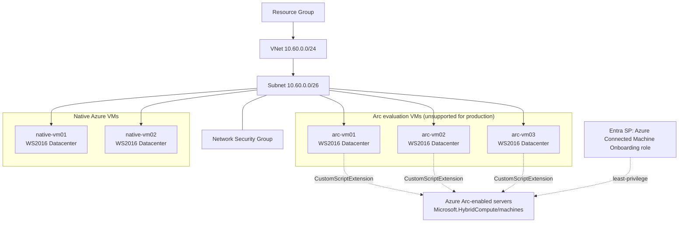

# Windows Server 2016 Azure Arc Evaluation Demo

## 1. Solution overview

Terraform IaC that deploys a small, temporary demonstration environment in **Sweden
Central** containing **five Windows Server 2016 Datacenter virtual machines**:

- **Three** VMs (`arc-vm01`, `arc-vm02`, `arc-vm03`) are automatically prepared and
  onboarded as **Azure Arc-enabled servers, for evaluation/testing only**.
- **Two** VMs (`native-vm01`, `native-vm02`) remain standard, unmodified native Azure VMs.

All five VMs are created from a **single reusable module** ([modules/windows-vm](modules/windows-vm/main.tf))
driven by one typed map variable (`var.vm_configs`), share one virtual network/subnet, and
are optimised for low cost, fast deployment, and easy teardown.

> **⚠️ Azure Arc evaluation warning**
> Connecting an Azure VM to Azure Arc-enabled servers is **unsupported for production**.
> It is permitted **only** for evaluation/testing, and only when the VM is deliberately
> reconfigured to behave like a non-Azure machine (see [Microsoft's guidance](https://learn.microsoft.com/en-us/azure/azure-arc/servers/plan-evaluate-on-azure-virtual-machine)).
> The three `arc-vm*` machines in this repo are configured exactly for that purpose and
> must never be treated as a production Arc pattern.

## 2. Architecture overview



## 3. Resource inventory

| Resource                       | Count        | Notes                                                 |
| ------------------------------ | ------------ | ----------------------------------------------------- |
| Resource group                 | 1            | Dedicated to this demo                                |
| Virtual network + subnet       | 1 each       | Shared by all 5 VMs                                   |
| Network security group         | 1            | Subnet-level, minimum required rules                  |
| Windows VMs                    | 5            | Single reusable module, `for_each`                    |
| NICs                           | 5            | One per VM                                            |
| Public IPs                     | 0 by default | Opt-in per VM                                         |
| Auto-shutdown schedules        | Up to 5      | Free `Microsoft.DevTestLab/schedules`, opt-out per VM |
| CustomScriptExtension          | 3            | Arc evaluation VMs only                               |
| Entra ID app/service principal | 1 (optional) | Least-privilege Arc onboarding identity               |
| Role assignment                | 1 (optional) | "Azure Connected Machine Onboarding" at RG scope      |

No storage account is deployed. The onboarding script is too large to inline directly
into the CustomScriptExtension's `commandToExecute` (Windows CSE always runs it via
`cmd /c`, which hard-limits command lines to 8191 characters), but rather than stage it
externally (a storage account blob), the script is gzip-compressed + base64-encoded down
to a few KB at apply time and decompressed by a small PowerShell bootstrap on the VM -
comfortably under the limit, with no external hosting, storage account, or network
dependency required. (An external-storage approach was tried first, but this subscription's
Azure Policy blocks both storage account keys and public network access on storage
accounts, so Terraform itself couldn't reach the data plane to stage the blob.)

No Bastion, Firewall, NAT Gateway, Load Balancer, Backup, Defender plans, or Log Analytics
are deployed.

## 4. VM allocation table

| VM name       | Management type      | Windows Server edition | Public IP   | Auto-shutdown |
| ------------- | -------------------- | ---------------------- | ----------- | ------------- |
| `arc-vm01`    | Azure Arc evaluation | 2016 Datacenter        | No (opt-in) | 19:00 daily   |
| `arc-vm02`    | Azure Arc evaluation | 2016 Datacenter        | No (opt-in) | 19:00 daily   |
| `arc-vm03`    | Azure Arc evaluation | 2016 Datacenter        | No (opt-in) | 19:00 daily   |
| `native-vm01` | Native Azure VM      | 2016 Datacenter        | No (opt-in) | 19:00 daily   |
| `native-vm02` | Native Azure VM      | 2016 Datacenter        | No (opt-in) | 19:00 daily   |

## 5. Windows Server edition: why all five VMs use Datacenter

The original design called for a **mix of Windows Server 2016 Standard and Datacenter**.
Before generating any code, the Azure Marketplace catalog was queried directly:

```bash
az vm image list --publisher MicrosoftWindowsServer --offer WindowsServer \
  --all --location swedencentral --query "[].sku" -o tsv | sort -u | grep -i 2016
```

Result: the `MicrosoftWindowsServer:WindowsServer` offer publishes **only** a
`2016-Datacenter` SKU (plus Server Core / smalldisk / zh-cn variants of Datacenter).
**No `2016-Standard` SKU exists anywhere in the Marketplace**, in Sweden Central or any
other region - this was confirmed both region-scoped and globally. Windows Server 2016
was never published as a separate "Standard" gallery image the way 2012 R2 was.

Per explicit instruction, **all five VMs use Windows Server 2016 Datacenter** instead of
inventing or substituting a different OS/version. The verified image reference is stored
once in [locals.tf](locals.tf) (`local.os_images`) and selected via each VM's `os_edition`
value (`windows-server-2016-datacenter` is the only accepted value - enforced by variable
validation in [variables.tf](variables.tf)):

```
publisher = MicrosoftWindowsServer
offer     = WindowsServer
sku       = 2016-Datacenter
version   = 14393.9418.260809   # latest verified in swedencentral on 2026-08-24
```

Datacenter edition licensing is included in the Marketplace pay-as-you-go image price;
this is **not** customer-provided/Hybrid Benefit licensing unless you explicitly enable
`enable_azure_hybrid_benefit` (default `false` - see §20).

## 6. Azure Arc evaluation approach

For `arc-vm01..03`, a single `CustomScriptExtension` ([modules/arc-onboarding](modules/arc-onboarding/main.tf))
runs one orchestrator script that, in order:

1. Sets the `MSFT_ARC_TEST` machine environment variable to `true`.
2. Creates **persistent Windows Firewall rules** blocking outbound access to
   `169.254.169.254` (IMDS) and `169.254.169.253` (WireServer). These are host-firewall
   rules, not NSG rules, because IMDS/WireServer traffic is link-local and bypasses NSGs
   entirely (handled by the Azure hypervisor).
3. Downloads and installs the Azure Connected Machine agent.
4. Runs `azcmagent connect` using a **least-privilege Entra ID service principal**
   (see §11) scoped only to the "Azure Connected Machine Onboarding" role.
5. Verifies the connection (`azcmagent show`).
6. Registers a **one-time Scheduled Task, deferred ~5 minutes**, that stops and disables
   the Azure Windows VM Guest Agent.

Step 6 is deliberately deferred rather than run inline - see §8 "Known limitations."

Native VMs (`native-vm01`, `native-vm02`) receive **no** extension, no MSFT_ARC_TEST
variable, no firewall changes, and are never connected to Arc; they remain fully
manageable via normal Azure VM extension operations.

## 7. Prerequisites

- Terraform >= 1.9.0
- Azure CLI, authenticated (`az login`) or `ARM_*`/`TF_VAR_*` environment variables set
- `bash`, `jq`, `gzip`, and `base64` available on the machine running Terraform (used to
  compress the Arc onboarding script - see §6; all present in this repo's devcontainer)
- An Azure subscription with quota for `Standard_B2s_v2` in Sweden Central
- Entra ID permission to create an application/service principal (only if
  `arc_onboarding_method = "service_principal_new"`, the default - see §10 for
  alternatives if your tenant restricts this)

## 8. Known limitations

- **Once the Guest Agent is disabled on an Arc evaluation VM, Terraform/Azure VM
  extensions can no longer reliably manage that VM.** Any future change to the
  `CustomScriptExtension` on an `arc-vm*` machine after the Guest Agent has been disabled
  may fail to apply, or may leave the extension resource in a non-terminal state. If you
  need to change the onboarding script, either re-provision the VM or apply the change
  interactively (RDP/Serial Console) using the standalone scripts in `scripts/`.
- The deferred Guest Agent disable (a Scheduled Task, ~5 minutes after onboarding) is a
  real, unavoidable delay: the disable action targets the very agent that launched the
  script running it, so it cannot safely run inline. This is not an arbitrary sleep - see
  the comment header in [modules/arc-onboarding/templates/arc-onboarding.ps1.tftpl](modules/arc-onboarding/templates/arc-onboarding.ps1.tftpl).
- "Removing incompatible extensions before onboarding" cannot be done from inside the
  guest OS (extensions are ARM-level child resources). This configuration only ever
  attaches the one onboarding extension, so there is nothing to remove; if you have
  manually attached other extensions, remove them via `az vm extension delete` first.
- Terraform's `azuread_service_principal_password` resource necessarily stores the
  service principal secret in Terraform state, and the rendered onboarding script
  (including that secret) is stored in state as part of the extension's
  `protected_settings`. See §24 "Terraform state security."
- Without Bastion, a VPN, or a public IP, there is **no network path to RDP into any VM**
  that has `enable_public_ip = false` (the default for all five VMs). Use the optional
  per-VM public IP + restricted RDP feature (§15) for temporary direct access, or connect
  via a jump box/VPN of your own.

## 9. Required Azure roles

| Task                                                | Minimum role                                                                                                                                 |
| --------------------------------------------------- | -------------------------------------------------------------------------------------------------------------------------------------------- |
| Deploy VMs, networking, resource group              | `Contributor` on the target subscription/resource group                                                                                      |
| Create/manage Azure Arc-enabled server resources    | `Contributor` (includes `Microsoft.HybridCompute/*`) or the built-in `Azure Connected Machine Onboarding` role, scoped to the resource group |
| Create the onboarding service principal             | `Application Administrator` (or `Application Developer` + admin consent) in Microsoft Entra ID                                               |
| Assign the onboarding role to the service principal | `User Access Administrator` or `Owner` on the resource group                                                                                 |

## 10. Arc onboarding authentication method

Set via `arc_onboarding_method`, one of three mutually-exclusive values:

| Method                            | What it needs                                                                               | Automation level                                                             |
| --------------------------------- | ------------------------------------------------------------------------------------------- | ---------------------------------------------------------------------------- |
| `service_principal_new` (default) | `Application Administrator`/`Cloud Application Administrator` in Entra ID                   | Fully automated                                                              |
| `service_principal_existing`      | An SP created out-of-band; only `Owner`/`User Access Administrator` on the RG for Terraform | Fully automated                                                              |
| `interactive_user`                | Only `Owner`/`User Access Administrator` on the RG for Terraform                            | Prep + agent install automated; `azcmagent connect` is a manual, per-VM step |

**`service_principal_new`** (default): Terraform creates a dedicated Entra ID
application + service principal, assigns it **only** the built-in
`Azure Connected Machine Onboarding` role at the resource group scope, and generates a
short-lived (24h) client secret used solely to run `azcmagent connect` on the three Arc
evaluation VMs.

**If `terraform apply` fails with:**
```
Error: Could not create service principal
... 403 Forbidden ... Authorization_RequestDenied: When using this permission, the
backing application of the service principal being created must in the local tenant
```
This message is misleading - the real cause is almost always that your account **lacks
the Entra ID permission to create service principals** (it requires the `Application
Administrator` or `Cloud Application Administrator` directory role, or the
`Application.ReadWrite.All` Graph permission). Check your roles with:
```bash
az rest --method get --url "https://graph.microsoft.com/v1.0/me/memberOf" --query "value[].displayName" -o tsv
```
If you only have read-only roles (e.g. `Global Reader`):

**`service_principal_existing`** - create the service principal yourself out-of-band and
let Terraform only *read* and use it (reading via a data source requires no special
Entra role, only *creating* one does):
```bash
az ad sp create-for-rbac --name "spn-ws16arc-demo-swc-01-arc-onboarding" --skip-assignment
```
Then set `arc_onboarding_method = "service_principal_existing"` in `terraform.tfvars` and export:
```bash
export TF_VAR_arc_service_principal_client_id='<appId from above>'
export TF_VAR_arc_service_principal_secret='<password from above>'
```

**`interactive_user`** - use this if even `az ad sp create-for-rbac` fails with
`Insufficient privileges to complete the operation` (the tenant blocks app/SP creation
entirely for your account, common in locked-down eval/sandbox tenants). No Entra ID app
or service principal is created at all. Instead:
1. Set `arc_onboarding_method = "interactive_user"` in `terraform.tfvars`. Terraform
   grants the `Azure Connected Machine Onboarding` RBAC role directly to your own
   account (or to `interactive_onboarding_principal_id` if you set one) - this only needs
   `Owner`/`User Access Administrator` on the resource group, a completely different
   permission model from Entra ID app creation.
2. `terraform apply` completes prep (MSFT_ARC_TEST, firewall rules) and installs the
   Connected Machine agent automatically on `arc-vm01/02/03`, but does **not** run
   `azcmagent connect` - that step requires an interactive device-code/browser login,
   which cannot run unattended inside a CustomScriptExtension.
3. For each Arc evaluation VM, RDP or Serial-Console in and run:
   ```powershell
   .\scripts\Complete-InteractiveArcOnboarding.ps1 -TenantId '<tenant-id>' `
     -SubscriptionId '<subscription-id>' -ResourceGroupName '<rg-name>' `
     -Location 'swedencentral' -ResourceName '<computer-name, e.g. arcvm01>'
   ```
   This prompts a device-code URL/code - sign in with the account that was granted the
   RBAC role in step 1. It then schedules the same deferred Guest Agent disable used by
   the automated methods.

## 11. Secure credential configuration

Never put secrets in `terraform.tfvars`. Use environment variables:

```bash
export TF_VAR_admin_password='choose-a-strong-password-12+chars'
export TF_VAR_subscription_id="$(az account show --query id -o tsv)"
export TF_VAR_tenant_id="$(az account show --query tenantId -o tsv)"

# Only if arc_onboarding_method = "service_principal_existing":
export TF_VAR_arc_service_principal_client_id='...'
export TF_VAR_arc_service_principal_secret='...'
```


`admin_password` and both service-principal variables are marked `sensitive = true` and
are never written to outputs.

## 12. Configuration instructions

```bash
cp terraform.tfvars.example terraform.tfvars
# edit terraform.tfvars: workload_name, environment, owner, intended_deletion_date, etc.
# (do NOT put admin_password or SP secrets in this file)
```

## 13. Image availability verification instructions

Re-verify before every deployment if you're unsure the Marketplace catalog hasn't
changed:

```bash
az vm image list --publisher MicrosoftWindowsServer --offer WindowsServer \
  --sku 2016-Datacenter --location swedencentral -o table
```

If this returns no rows, **stop** - do not substitute a different Windows Server
version/edition without updating `locals.tf` deliberately and re-reading this section.

## 14. Public RDP security warning

`enable_public_rdp` **cannot** be enabled without also setting `enable_public_ip = true`
and a `trusted_rdp_source_cidr`. Terraform variable validation actively **rejects**
`0.0.0.0/0`, `*`, or `Internet` as a trusted CIDR - RDP must never be exposed to the whole
internet. Always scope `trusted_rdp_source_cidr` to your own public IP (`/32`) or a small
corporate range.

## 15. Deployment commands

```bash
terraform init
terraform fmt -check
terraform validate
terraform plan -out=tfplan
terraform apply tfplan
```

## 16. Verification instructions

**Confirm the three Arc evaluation machines and two native VMs:**

```bash
# Arc-enabled servers (expect exactly arc-vm01, arc-vm02, arc-vm03)
az resource list --resource-group <rg-name> --resource-type Microsoft.HybridCompute/machines -o table

# All Azure VM resources (expect all five)
az vm list --resource-group <rg-name> -o table

# Confirm Windows Server edition per VM
az vm show --resource-group <rg-name> --name arc-vm01 --query "storageProfile.imageReference.sku" -o tsv
```

**On each Arc evaluation VM** (via RDP/Serial Console, since the Guest Agent will be
disabled): run `scripts/Test-ArcEvaluationConfiguration.ps1` to confirm MSFT_ARC_TEST,
firewall rules, Guest Agent status, and `azcmagent show` all pass.

## 17. Troubleshooting

| Symptom                                                                                       | Likely cause / fix                                                                                                                                                                                                                                                                                                    |
| --------------------------------------------------------------------------------------------- | --------------------------------------------------------------------------------------------------------------------------------------------------------------------------------------------------------------------------------------------------------------------------------------------------------------------- |
| `SkuNotFound` deploying the VM image                                                          | Marketplace catalog changed - re-run §13's verification command                                                                                                                                                                                                                                                       |
| `Could not create service principal` / 403 "must be in the local tenant"                      | Misleading message - your account lacks `Application Administrator`/`Application.ReadWrite.All`. Switch to `arc_onboarding_method = "service_principal_existing"` or `"interactive_user"` - see §10.                                                                                                                  |
| `az ad sp create-for-rbac` fails with "Insufficient privileges to complete the operation"     | Your tenant blocks app/SP creation entirely for this account. Use `arc_onboarding_method = "interactive_user"` instead - see §10.                                                                                                                                                                                     |
| CustomScriptExtension stuck "Creating"/never succeeds                                         | Check `C:\ArcEvaluation\onboarding.log` via Serial Console; agent may have been disabled prematurely, or outbound HTTPS is blocked                                                                                                                                                                                    |
| `VMExtensionProvisioningError` "The command line is too long"                                 | The script exceeded cmd.exe's 8191-character limit for `commandToExecute` - fixed by gzip-compressing the script before embedding it (see §6). If you see this after further editing the template, the script grew too large to compress under the limit - keep the template lean, or re-check the compression ratio. |
| `terraform plan`/`apply` fails running `modules/arc-onboarding/scripts/compress-script.sh`    | Requires `bash`, `jq`, `gzip`, and `base64` on the machine running Terraform (all present in this repo's devcontainer). Install them, or run Terraform from an environment that has them, if applying from elsewhere.                                                                                                 |
| `KeyBasedAuthenticationNotPermitted` / `publicNetworkAccess: Disabled` on any storage account | Not applicable to this configuration - it deploys no storage account at all (see §6) specifically to avoid subscriptions that enforce these policies.                                                                                                                                                                 |
| `a resource ... already exists ... needs to be imported` for the extension                    | A previous failed apply still created the extension in Azure (in a `Failed` state) even though Terraform didn't record it in state. Run `terraform import 'module.arc_onboarding["<vm-name>"].azurerm_virtual_machine_extension.arc_onboarding' '<resource-id>'` for each affected VM, then re-plan/apply.            |
| `azcmagent connect` fails with auth error                                                     | Confirm the RBAC role assignment has propagated (Terraform waits 30s automatically via `time_sleep`); re-run `scripts/Connect-AzureArcServer.ps1` (SP) or `scripts/Complete-InteractiveArcOnboarding.ps1` (interactive) manually if needed                                                                            |
| Outbound connectivity failures during onboarding                                              | NSG default outbound rules already allow HTTPS; check no custom NSG/firewall changes were made outside this config                                                                                                                                                                                                    |
| `Invoke-WebRequest` fails with "Could not create SSL/TLS secure channel."                     | Windows Server 2016's default .NET TLS setting excludes TLS 1.2. Already fixed by setting `[Net.ServicePointManager]::SecurityProtocol = [Net.SecurityProtocolType]::Tls12` before any download in the onboarding script/`Install-ArcConnectedMachineAgent.ps1`.                                                      |
| IMDS still reachable after "prep" step                                                        | Confirm firewall rules exist: `Get-NetFirewallRule -DisplayName Block-Outbound-*`                                                                                                                                                                                                                                     |
| Can't RDP to any VM                                                                           | Expected - no public IP/Bastion/VPN by default. Enable `enable_public_ip`/`enable_public_rdp` for one VM temporarily (§14)                                                                                                                                                                                            |

## 18. Security considerations

- No public IPs, Bastion, VPN, or NSG inbound rules by default - fully private-by-default.
- RDP exposure (if enabled) is always scoped to an explicit, validated, non-internet CIDR.
- The Arc onboarding service principal is scoped to a single built-in role at resource
  group level - not `Owner`/`Contributor`.
- Secrets (`admin_password`, service principal secret) are marked `sensitive`, never
  defaulted, never output, and never written into committed script files.
- IMDS/WireServer blocking uses host-based Windows Firewall rules since NSGs cannot
  intercept this link-local traffic.

## 19. Terraform state security

Terraform state **will** contain sensitive values in plaintext, including the rendered
onboarding script (with the service principal secret) and the admin password reference.
For this throwaway/local demo, local state (the default here) is acceptable **only** if:

- the state file never leaves your machine/CI runner,
- it is deleted along with the environment (`terraform destroy` doesn't delete
  `terraform.tfstate` itself - remove it manually afterwards if it contains secrets you
  want gone), and
- it is never committed to git (already covered by `.gitignore`).

**Recommended for anything beyond a single-person, single-run demo:** move to an Azure
Storage backend with private access and encryption at rest:

```hcl
# backend.tf (create separately - do not hard-code credentials here)
terraform {
  backend "azurerm" {
    resource_group_name  = "rg-tfstate"
    storage_account_name = "sttfstateunique"
    container_name       = "tfstate"
    key                  = "ws16arc-demo.tfstate"
  }
}
```

Authenticate to the backend via `az login`/Managed Identity/OIDC - never embed a storage
account key in committed files.

## 20. Cost drivers (no prices invented)

- **VM compute hours** for 5x `Standard_B2s_v2` - the largest cost driver, mitigated by
  daily auto-shutdown (`default_auto_shutdown_enabled = true`).
- **Standard HDD OS disks** (`Standard_LRS`) x5 - lowest-cost managed disk tier.
- **Marketplace image licensing** for Windows Server 2016 Datacenter, included in the
  VM's pay-as-you-go price unless `enable_azure_hybrid_benefit = true` (requires you to
  already hold qualifying licences - never enabled by default).
- No Bastion, Firewall, NAT Gateway, Load Balancer, Backup, Defender, Log Analytics, or
  storage account costs are introduced by this configuration.

## 21. Auto-shutdown behaviour

Each VM gets a free `Microsoft.DevTestLab/schedules` auto-shutdown resource (not an Azure
DevTest Labs instance) unless `auto_shutdown_enabled = false` for that VM. Default time is
19:00 (`W. Europe Standard Time`), configurable globally (`default_auto_shutdown_time`) or
per VM (`vm_configs.<key>.auto_shutdown_time`). Notifications are disabled by default to
avoid needing a webhook/Action Group for this demo.

## 22. Cleanup instructions

**Disconnect Arc and uninstall the agent (optional, only if you want to keep the VM but
remove the Arc/evaluation configuration):**

```powershell
# Run interactively on each arc-vm* via RDP/Serial Console
.\scripts\Remove-ArcEvaluationConfiguration.ps1 -ServicePrincipalId '<client-id>' `
  -ServicePrincipalSecret (Read-Host -AsSecureString) -TenantId '<tenant-id>'
```

**Destroy the entire environment:**

```bash
terraform destroy
```

This removes the resource group (VMs, NICs, disks, VNet/subnet/NSG, extensions,
auto-shutdown schedules) and, if created by this config, the Entra ID application/service
principal and its role assignment. The Arc machine resources
(`Microsoft.HybridCompute/machines`) live inside the same resource group and are deleted
along with it - Terraform does not need a separate `azcmagent disconnect` step for pure
cleanup, though running it first is tidier if you plan to reuse the underlying identity.

## 23. Summary: architecture, deployment, validation, limitations

**Deployment sequence:** `terraform init` → `plan` → `apply` creates the resource group
and network first, then all five VMs in parallel via `for_each`, then (only for the three
`arc-vm*` VMs) the onboarding extension, which depends on the VM and on the service
principal's role assignment having propagated.

**Validation checklist:** `terraform validate` passes; `terraform plan` shows exactly 1
resource group, 1 VNet, 1 subnet, 1 NSG, 5 VMs/NICs, up to 5 auto-shutdown schedules, 3
onboarding extensions, and (if enabled) 1 Entra application/service principal/role
assignment - no Bastion/Firewall/NAT/LB/Backup/Defender/Log Analytics resources.

**Cleanup sequence:** optionally run `Remove-ArcEvaluationConfiguration.ps1` on each Arc
VM, then `terraform destroy`.
